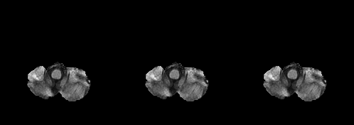
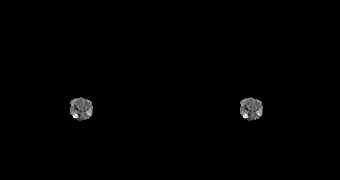
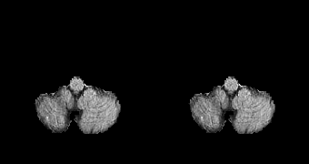
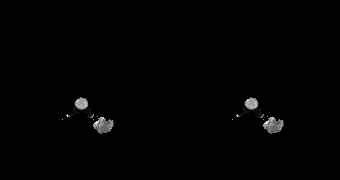
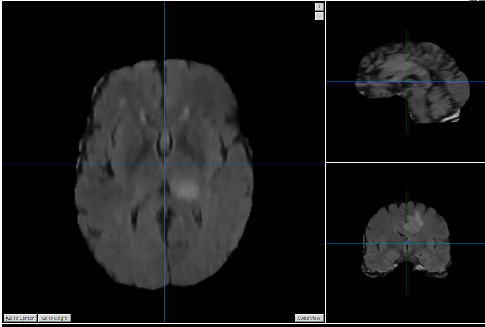
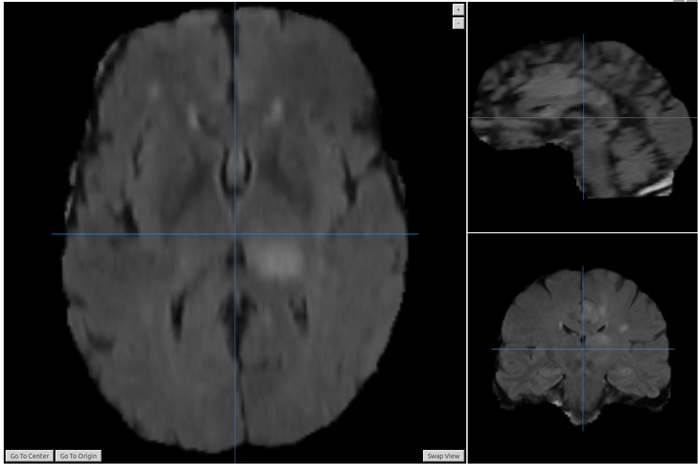

# 3D ESPNet for segmenting brain images [[Paper](https://link.springer.com/chapter/10.1007/978-3-030-11726-9_22)]

This repository extends the [ESPNet, (ECCV'18)](https://arxiv.org/abs/1803.06815) architecture (also extended to whole slide image (WSI) segmentation in [Y-Net, (MICCAI'18)](https://arxiv.org/pdf/1806.01313.pdf)) to volumetric images. We use the BRATS 2018 dataset for volumetric segmentaiton task.

Below are the segmentation results produced by our method. Results in the first row are on the training set while results in the last two rows are on the official evaluation set for which we do not have the expert markings. 

Our system learns about **3.6 million parameters** and achieves the dice score of **0.74, 0.88, and 0.81** for segmenting **enhancing tumour, whole tumour, and core mask** on the official BRATS'18 evaluation set. Please check the [leaderboard](https://www.cbica.upenn.edu/BraTS18/lboardValidation.html) for more details (Our model name is GBMNet). Note that we do not use any additional data for training.

**Visualizations on the training set**

<table>
 <tr width="100%">
  <td width="45%" align="center">
     
  </td>
  <td width="45%" align="center">
      
  </td>
 </tr>
 <tr >
  <td colspan=2 width="45%" align="center"> 
    
  </td>
 </tr>
</table>

**Visualizations on the official BRATS'18 validation set**

<table>
 <tr width="100%">
  <td width="45%" align="center">
     
  </td>
  <td width="45%" align="center">
      
  </td>
 </tr>
 <tr width="100%">
  <td width="45%" align="center">
     
  </td>
  <td width="45%" align="center">
      
  </td>
 </tr>
</table>

## Training on the BRATS 2018 dataset

### Step 1: Dataset pre-processing
 1. First, download the [BRATS'18](https://www.med.upenn.edu/sbia/brats2018/data.html) dataset (registration may be required).
 2. Extract the volumetric images from the downloaded zip file inside a folder ```./data```. After unzipping, ```./data``` should contain the ```HGG``` and ```LGG``` folders.
 3. Create a directory called ```./data/original_brats18``` and move ```./data/HGG``` and ```./data/LGG``` folders inside ```./data/original_brats18```.  
 4. Run ```python preprocessing.py``` to crop the volumetric images inside the ```./data/original_brats18``` directory. The resulting cropped volumes will be stored in ```./data/original_brats18_preprocess```.
 5. You can delete ```./data/original_brats18``` directory because we do not need these images for training.  
 6. Now, copy the ```gen.py``` file inside the folder ```./data/original_brats18_preprocess``` and execute it from that directory. It will generate a ```train.txt```  file that contains the mapping between FLAIR image and segmentation mask, something like below text
 ```
 /HGG/Brats18_TCIA01_390_1/Brats18_TCIA01_390_1_flair.nii.gz, /HGG/Brats18_TCIA01_390_1/Brats18_TCIA01_390_1_seg.nii.gz
/HGG/Brats18_CBICA_AYA_1/Brats18_CBICA_AYA_1_flair.nii.gz, /HGG/Brats18_CBICA_AYA_1/Brats18_CBICA_AYA_1_seg.nii.gz
.....
 ``` 
**Important Note:** Please make sure to adjust the data directory paths inside the script.

Original            |  Processed (After cropping)
:-------------------------:|:-------------------------:
  |  

### Step 2: Selecting a validation set
**Option 1:** You can split the training set into 80:20 ratio, where the data corresponding to the larger split will be used for training while the data corresponsing to the smaller split will be used for validation.

**Option 2:** You can use cross-validation.

**Option 3:** Use BRATS'17 training data as a validation data. Since BRATS'17 training data has an overlap with BRATS'18, please make sure to remove the overlapping data. 

Since there are very few images for training, we opted for **Option 3**. Repeat all steps in **Step 1** to generate the ```val.txt``` file.

**Note**: Make sure to update the variable ```writeText = open('val.txt', 'w')```  in the ```gen.py``` file.

### Step 3: Training the models
To train the model, run the following command:
```
python main.py 
```
Please see ```main.py``` file for the description of supported command line arguments.

To resume the training from a checkpoint, you can do it as following:
```
python main.py --resume True --resumeLoc <checkpoint_file> 
``` 

### Step 4: Testing the trained models

#### Compute Dice Score on the validation set
BRATS'18 measures the accuracy using Dice score for three types of segmentation masks: (1) whole tumour, (2) core mask, and (3) enhancing mask. 

You can compute the dice scores using the following script:
```
python ComputeDice.py 
```

**Note:** Please make sure to change the variable names in lines 190-193.

### Step 5: Generating results on the official evaluation and test set

#### Set-up
 1. Download the evaluation or test data from the Brats'18 website.
 2. Now, create a directory called ```./data/test```
 3. Copy the downloaded zip file inside ```./data/test``` and then unzip it. After unzipping, you will see two folders, (**HGG** and **LGG**), inside ```./data/test``` directory.  
 4. Now, copy ```gen_official.py``` file inside the folder ```./data/test``` and execute it from that directory. It will generate a ```test.txt```  file that contains the FLAIR image file names, something similar to this:
 ```
 /HGG/Brats18_TCIA01_390_1/Brats18_TCIA01_390_1_flair.nii.gz, 
/HGG/Brats18_CBICA_AYA_1/Brats18_CBICA_AYA_1_flair.nii.gz, 
.....
 ``` 

## Generate results on the official evaluation set
After you are done with the set-up part, you can generate the segmentation results on the official evaluation and test sets using the following script:
```
python VisualizeResults.py 
```

Please make sure to change the variable names inside the files so that they are pointing to correct data directories and pretrained weight files.

**Note 1:** You do not need to pre-process these images. This is done on the fly inside the ```VisualizeResults.py``` script.

## Dependencies

Please see ```requirements.txt``` for the dependencies

## Citation
If this work is useful for you, please consider citing the following papers:

```
@inproceedings{mehta20193despnet,
author="Nuechterlein, Nicholas and Mehta, Sachin",
title="3D-ESPNet with Pyramidal Refinement for Volumetric Brain Tumor Image Segmentation",
booktitle="Brainlesion: Glioma, Multiple Sclerosis, Stroke and Traumatic Brain Injuries",
year="2019",
publisher="Springer International Publishing",
}

@inproceedings{mehta2018ynet,
  title={{Y-Net: Joint Segmentation and Classification for Diagnosis of Breast Biopsy Images}},
  author={Sachin Mehta and Ezgi Mercan and Jamen Bartlett and Donald Weaver and Joann  Elmore and Linda Shapiro},
  booktitle={International Conference on Medical image computing and computer-assisted intervention},
  year={2018},
  organization={Springer}
}

@inproceedings{mehta2018espnet,
  title={ESPNet: Efficient Spatial Pyramid of Dilated Convolutions for Semantic Segmentation},
  author={Sachin Mehta, Mohammad Rastegari, Anat Caspi, Linda Shapiro, and Hannaneh Hajishirzi},
  booktitle={European Conference in Computer Vision (ECCV)},
  year={2018}
} 
```
